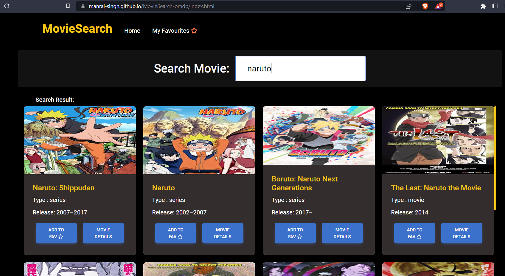
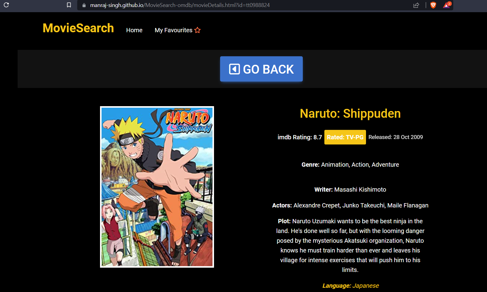
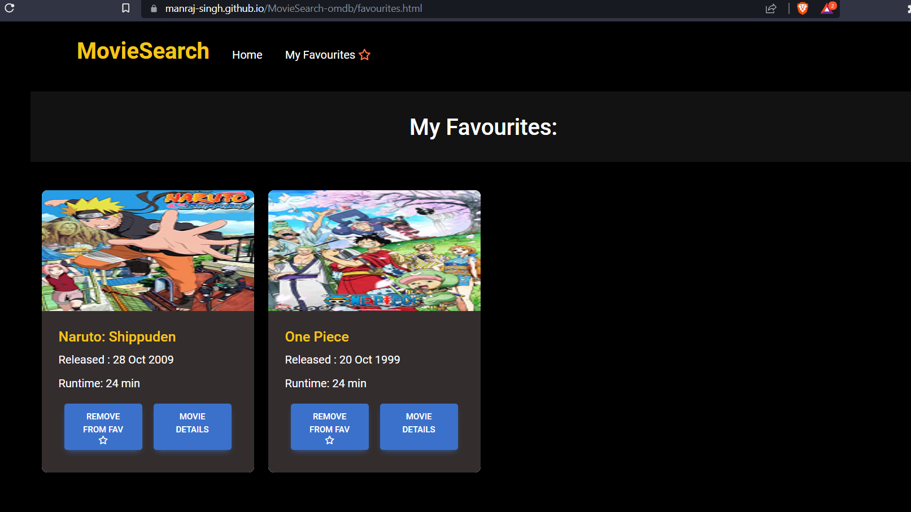

# MovieSearch-OMDB

**Deployed on :** https://manraj-singh.github.io/MovieSearch-omdb/

**Overview :** Imdb inspired app where users can search for a movie ,see its details and add it to their favourites list.

## Tech Stack

_HTML , CSS , Vanilla JS , Bootstrap_

## API Reference

```http
 API : http://www.omdbapi.com/

 usage: http://www.omdbapi.com/?apikey=[yourkey]&i=[movieid]
        http://www.omdbapi.com/?apikey=[yourkey]&s=[movietitle]
```

## Run Locally

Clone the project

```bash
  git clone https://github.com/Manraj-singh/MovieSearch-omdb.git
```

Go to the assets/js/index.js file and add your APIKEY(get it from API)

```bash
  eg. const APIKEY = "8850ebe7";
```

finally open the index.html file

## Features

- Home Page:

```bash
- Search any movie by typing into the search box and result gets updated as user types the movie name (similar to google suggestions).
- Each search result of the movie has a favourite button ,clicking on which movie gets addded to 'My favourites' list.
- Each search result has a more details button ,clicking on which ,opens a new page with the complete details of the movie.

```

- Movie Page:

```bash
- This page shows the complete imformation about the movie like name, photo, plot, etc.
```

- My favourites page:

```bash
- Displays a list of all favourite movies added by user.
- Each movie has a remove button to remove it from list and details button to view more details
- Used localStorage to make the list persistent
```

## Demo

- Home Page
  
- Details page
  
- Favourites page
  
